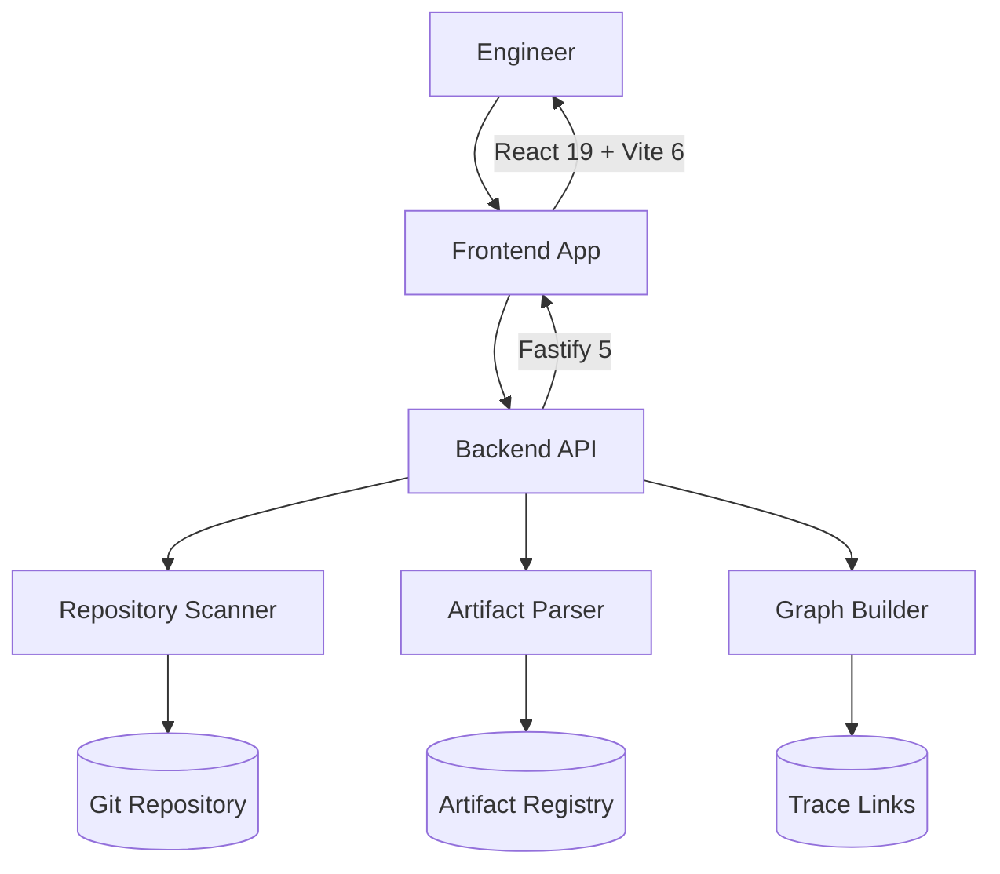

# Nexus Engineering

> **Engineering as Code Viewer & Traceability Platform**

[](https://www.typescriptlang.org/)
[](https://fastify.dev/)
[](https://react.dev/)
[](https://vitejs.dev/)
[](https://tailwindcss.com/)
[](https://pnpm.io/)
[](https://railway.app/)
[](LICENSE)

---

## Overview

Nexus Engineering enables engineering teams to **manage requirements, architecture decisions, features, and test results as code** with full traceability across the entire engineering lifecycle.

The platform automatically discovers, parses, and links engineering artifacts from Git repositories, providing:

- **Requirements as Code (RAC)** — Structured YAML requirement documents with acceptance criteria, dependencies, and trace links
- **Architecture as Code (AAC)** — Architecture Decision Records (ADRs) and architecture models in YAML
- **Feature as Code (FAC)** — Feature documents with user stories, acceptance criteria, and trace links
- **Test Execution as Code (TER)** — Structured test execution results with CI integration
- **Traceability as Code (TAC)** — End-to-end trace links between requirements, architecture, features, and tests
- **SSO & RBAC** — OAuth (Google/GitHub), SAML v2, organization-level role-based access control
- **Multi-Repo Scanning** — Scan and index artifacts across multiple repositories
- **Audit Log** — Structured audit trail with query API, CSV export, and retention policies

---

## Architecture



### Stack

| Layer | Technology |
|-------|-----------|
| Monorepo | pnpm workspaces |
| Backend | Fastify 5 + TypeScript |
| Frontend | React 19 + Vite 6 + Tailwind CSS 3.4 |
| Shared | TypeScript types, validation, design system |
| Auth | JWT (RS256), OAuth 2.0, SAML v2, bcrypt |
| Database | SQLite (better-sqlite3), in-memory or file |
| CI/CD | GitHub Actions, Railway |
| AI | Coverage gap detection, impact analysis, LLM cache |

---

## Quickstart

```bash
# Prerequisites: Node.js 20+, pnpm 9+
git clone <repository-url>
cd nexus-engineering
pnpm install
pnpm dev
```

- **Frontend**: http://localhost:5173
- **Backend API**: http://localhost:3001
- **Health Check**: http://localhost:3001/health

### Run demo import

```bash
node scripts/import-demo.js
```

---

## Repository Structure

```
nexus/
├── apps/
│   ├── backend/          # Fastify API server
│   │   └── src/
│   │       ├── routes/   # API route handlers
│   │       ├── auth/     # Authentication (JWT, OAuth, SAML)
│   │       ├── scanners/ # Repository scanning
│   │       ├── parsers/  # Artifact parsing
│   │       ├── organizations/ # Org management
│   │       ├── auditLog/ # Audit log engine
│   │       └── ai/       # AI analysis modules
│   └── frontend/         # React application
│       └── src/
│           ├── views/    # Page components
│           ├── components/# Shared UI
│           └── api/      # API client
├── packages/
│   ├── shared/           # Shared types, validation, design system
│   └── eslint-config/    # Shared ESLint config
├── docs/                 # Documentation
├── examples/             # Sample documents
└── scripts/              # Utility scripts
```

---

## Documentation

| Document | Description |
|----------|-------------|
| [Setup Guide](docs/SETUP_GUIDE.md) | Prerequisites, install, configure, run, deploy |
| [Quickstart Tutorial](docs/quickstart.md) | Step-by-step first-user guide |
| [Architecture](docs/ARCHITECTURE.md) | System architecture, data flow, deployment |
| [API Reference](docs/API_REFERENCE.md) | Complete API documentation |
| [Developer Guide](docs/DEVELOPER_GUIDE.md) | Contributing, testing, code style |
| [Deployment Guide](docs/DEPLOYMENT.md) | Railway deployment, CI/CD |
| [Demo Project](docs/demo/) | Pre-built demo with seed data |
| [Coding Standards](docs/CODING_STANDARDS.md) | TypeScript, React, Fastify conventions |

---

## Scripts

| Command | Description |
|---------|-------------|
| `pnpm dev` | Start dev servers (backend :3001, frontend :5173) |
| `pnpm build` | Production build |
| `pnpm typecheck` | TypeScript check |
| `pnpm lint` | ESLint |
| `pnpm test` | Run tests |
| `node scripts/import-demo.js` | Import demo project seed data |

---

## Project Status

| Sprint | Focus | Status |
|--------|-------|--------|
| Sprint 9 | Auth + RBAC + Engineering as Code | ✅ Complete |
| Sprint 10 | Enterprise Phase 2 | ✅ Complete |
| Sprint 11 | TAC as Code | ✅ Complete |
| Sprint 12 | TER + FAC + AI Traceability | ✅ Complete |
| Sprint 13 | SSO/Enterprise Hardening + GTM Polish | 🎯 In Progress |

---

## License

MIT
