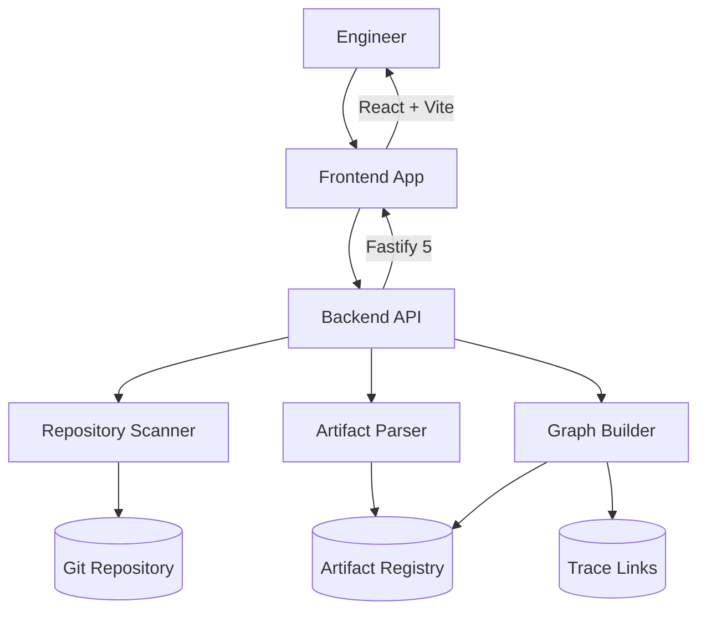
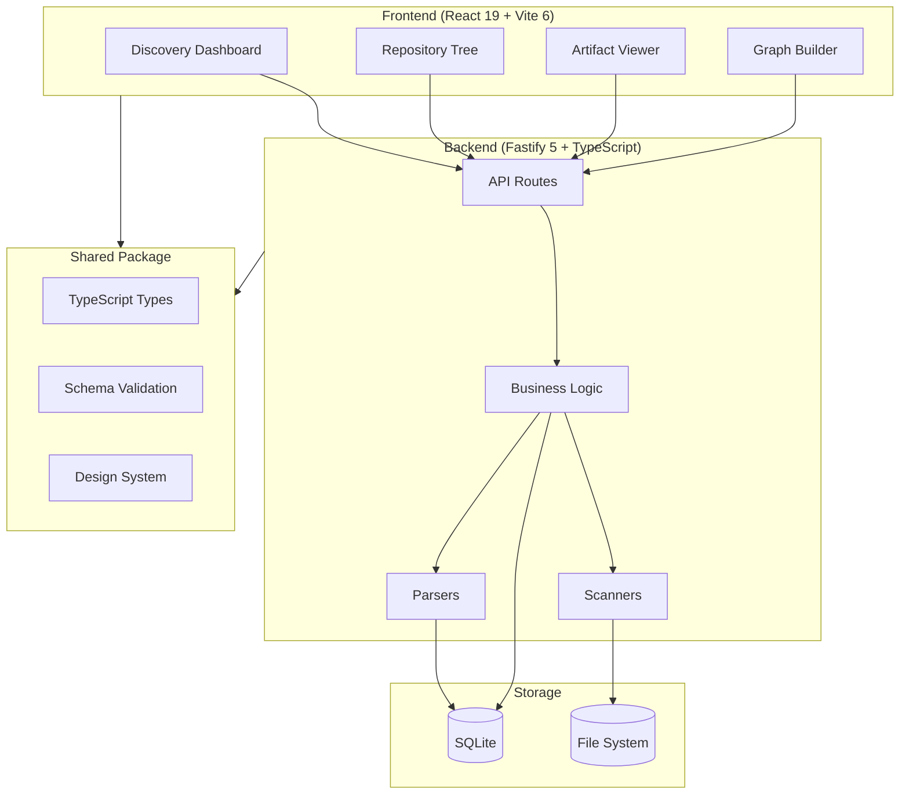
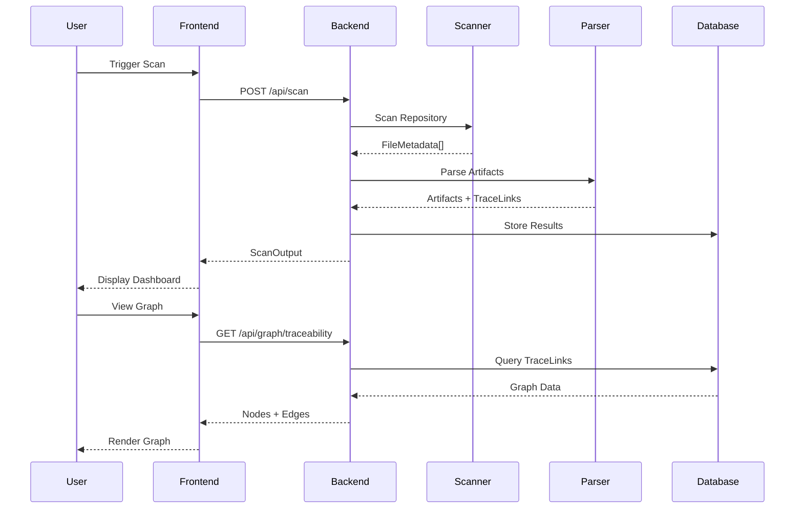
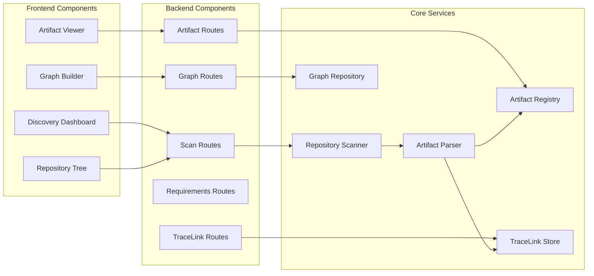
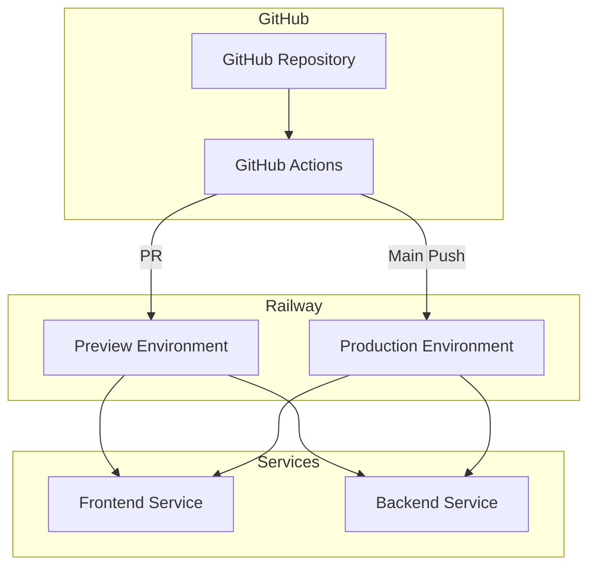

# Nexus Engineering Architecture

## Overview

Nexus Engineering is a modern web application for visualizing and navigating engineering artifacts managed as code in Git repositories. The system automatically discovers, analyzes, and links engineering artifacts to provide comprehensive traceability.

## System Context Diagram



## Container Diagram



## Data Flow Diagram



## System Components

### 1. Repository Scanner Foundation

#### Repository Reader Interface

The `RepositoryReader` interface provides standardized access to repository contents:

```typescript
interface RepositoryReader {
  scan(rootPath: string): Promise<ScanResult>;
  getFileMetadata(filePath: string): Promise<FileMetadata>;
  streamFiles(patterns: string[]): AsyncIterable<FileEntry>;
}
```

**Implementation**: `RepositoryScanner` class in `apps/backend/src/scanners/`

- Scans directory trees recursively with configurable ignore patterns
- Supports multiple file types (YAML, Markdown, JSON, XML, source code)
- Extracts metadata: file type, path, content hash, size
- Handles large files with size limits and streaming

#### File Type Support

| Extension | MIME Type | Document Type |
|-----------|-----------|---------------|
| `.yaml`, `.yml` | text/yaml | Yaml |
| `.md` | text/markdown | Md |
| `.json` | application/json | Json |
| `.xml`, `.xsd` | application/xml | Xml |
| `.html`, `.htm` | text/html | Html |
| - | - | Txt |

### 2. Artifact Metadata Extraction

**FileMetadata interface:**
```typescript
interface FileMetadata {
  filePath: string;
  relativePath: string;
  size: number;
  contentHash: string;
  contentType: 'text' | 'binary';
  detectedType?: 'requirement' | 'architectureModel' |
    'softwareComponent' | 'testCase' | 'traceLink';
}
```

- Content hash uses SHA-256 for consistency detection
- Automatic type detection based on path patterns and file extensions
- YAML frontmatter parsing for markdown files

### 3. Scanning Implementation

The scanner implements a recursive directory walker with:
- Configurable ignore patterns (`.git`, `node_modules`, etc.)
- Parallel processing for improved performance
- Error handling and partial results on scan failures
- Memory-efficient streaming for large repositories

**Key scan parameters:**
- Maximum file size: 10MB
- Minimum file size: 1KB (skip very small files)
- Depth limit: configurable (default: unlimited)
- Pattern matching: glob-style include/exclude patterns

## Component Diagram



## Deployment Architecture



## Code Structure

```
nexus/
├── apps/
│   ├── backend/
│   │   └── src/
│   │       ├── routes/           # API route handlers
│   │       ├── scanners/         # Repository scanning
│   │       ├── parsers/          # Artifact parsing
│   │       ├── graphBuilder/     # Graph construction
│   │       ├── artifacts/        # Artifact registry
│   │       └── traceabilityLinks/ # Trace link management
│   └── frontend/
│       └── src/
│           ├── views/            # Page components
│           │   ├── DiscoveryDashboard/
│           │   ├── RepositoryTree/
│           │   ├── ArtifactViewer/
│           │   └── GraphBuilder/
│           ├── components/       # Shared UI components
│           └── api/              # API client
├── packages/
│   ├── shared/                   # Shared types and utilities
│   │   └── src/
│   │       ├── types.ts          # Core data models
│   │       ├── requirements/     # Requirements loader
│   │       ├── validation/       # Schema validation
│   │       └── design-system/    # UI components
│   └── eslint-config/            # Shared ESLint config
└── docs/                         # Documentation
```

## Usage Examples

### Basic Repository Scan

```typescript
import { scanner } from '@nexus-engineering/scanners'

async function scanRepository() {
  const result = await scanner.scan('/path/to/repository')
  
  console.log(`Found ${result.report.documentsFound} documents`)
  console.log(`Errors: ${result.report.errors.length}`)
}
```

### Streaming Files with Pattern Matching

```typescript
async function streamMarkdownFiles() {
  const reader = new RepositoryReader()
  
  for await (const file of reader.streamFiles(['**/*.md'])) {
    console.log(`Found markdown: ${file.path}`)
  }
}
```

### Getting File Metadata

```typescript
async function getMetadata() {
  const metadata = await scanner.getFileMetadata('path/to/file.md')
  console.log(`Content hash: ${metadata.contentHash}`)
}
```

## Error Handling

The scanner implements comprehensive error handling:
- Silent continue on individual file read errors
- Error reporting per repository
- Partial results when scans fail mid-process
- Rate limiting and backoff for I/O operations

## Performance Considerations

- Parallel directory scanning with worker pool
- Memory-mapped file reading for large files
- Content hashing streaming to avoid memory spikes
- Lazy loading of file contents on-demand

## Testing Strategy

Unittest coverage includes:
- Basic file discovery (10 scenarios)
- Filtering and ignore patterns (5 scenarios)
- Metadata extraction accuracy (8 scenarios)
- Error handling (5 scenarios)
- Performance under load (stress tests)

Integration tests with real repository structures.

## Future Extensions

Planned enhancements:
1. Git repository scanning with history
2. Remote repository support (HTTP/S Git)
3. Parallel repository processing
4. Caching layer for repeated scans
5. Incremental scan support
6. Watch mode for file system changes
