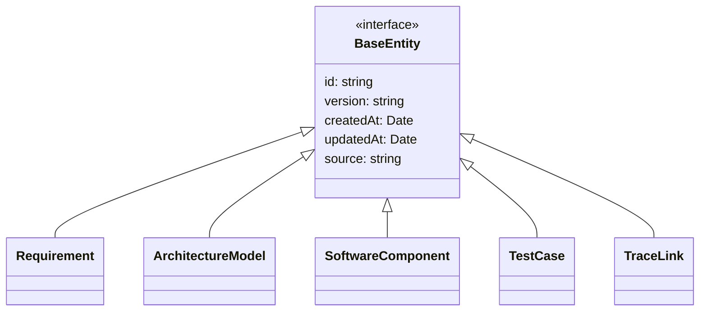
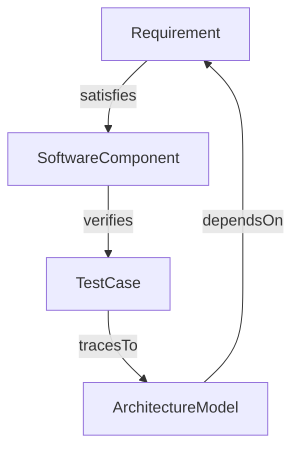

# Unified Engineering Data Model

## Overview

This document defines the unified data model for Nexus Engineering System. The model consists of TypeScript interfaces that represent core engineering artifacts including requirements, architecture models (SysML subset), software components, test cases, and traceability links.

## Entity Diagrams



## Core Types

### BaseEntity (Common Metadata)

All entities inherit from `BaseEntity` which provides common metadata fields:

- `id` (string): Unique identifier
- `version` (string): Semantic version of the entity
- `createdAt` (Date): Creation timestamp
- `updatedAt` (Date): Last modification timestamp
- `source` (string): Origin/traceability reference

### Requirement

```typescript
interface Requirement extends BaseEntity {
  type: 'functional' | 'non-functional' | 'system' | 'user';
  title: string;
  description: string;
  priority: 'low' | 'medium' | 'high' | 'critical';
  status: 'proposed' | 'approved' | 'rejected' | 'implemented' | 'verified';
  tags?: string[];
}
```

### ArchitectureModel

```typescript
interface ArchitectureModel extends BaseEntity {
  type: 'blockDefinition' | 'internalBlockDiagram' | 'stateMachine' | 'sequenceDiagram' |
        'parametricDiagnostic' | 'requirementTraceabilityMatrix';
  name: string;
  description: string;
  elements: ArchitectureElement[];
  relationships?: ArchitectureRelationship[];
}
```

### SoftwareComponent

```typescript
interface SoftwareComponent extends BaseEntity {
  name: string;
  type: 'module' | 'class' | 'interface' | 'enum' | 'service' | 'component' |
        'microService' | 'library' | 'configuration';
  description: string;
  path?: string;
  language?: string;
  technologies?: string[];
  dependencies?: string[];
  version?: string;
}
```

### TestCase

```typescript
interface TestCase extends BaseEntity {
  name: string;
  type: 'unit' | 'integration' | 'system' | 'acceptable' | 'performance' |
        'security' | 'usability';
  description: string;
  testSteps?: TestStep[];
  expectedResult: string;
  status: 'draft' | 'ready' | 'inProgress' | 'completed' | 'failed';
  automationStatus: 'manual' | 'automated' | 'partially-automated';
}
```

### TraceLink

```typescript
interface TraceLink extends BaseEntity {
  sourceId: string;
  sourceType: 'requirement' | 'architectureModel' | 'softwareComponent' |
               'testCase' | 'traceLink';
  targetId: string;
  targetType: 'requirement' | 'architectureModel' | 'softwareComponent' |
               'testCase' | 'traceLink';
  relationshipType: 'satisfies' | 'verifies' | 'tracesTo' | 'dependsOn' |
                     'refines' | 'conflictsWith';
  confidence: 'high' | 'medium' | 'low';
  description?: string;
}
```

**Field Descriptions:**
- `type`: Categorizes the requirement (functional/safety/performance/etc.)
- `title`: Brief descriptive title
- `description`: Detailed requirement description
- `priority`: Impact assessment
- `status`: Lifecycle state
- `tags`: Optional categorization tags

**Example:**
```typescript
{
  id: 'req-001',
  version: '1.0.0',
  createdAt: new Date('2026-07-02'),
  updatedAt: new Date('2026-07-02'),
  source: 'initial-design',
  type: 'functional',
  title: 'User Authentication',
  description: 'System shall provide secure user authentication via OIDC',
  priority: 'high',
  status: 'approved'
}
```

### Software Component Example

```typescript
{
  id: 'comp-001',
  version: '1.0.0',
  createdAt: new Date('2026-07-02'),
  updatedAt: new Date('2026-07-02'),
  source: 'github.com/example/repo@v1.0.0',
  name: 'AuthenticationManager',
  type: 'class',
  description: 'Manages user authentication and session handling',
  path: 'src/auth/AuthenticationManager.ts',
  language: 'TypeScript',
  technologies: ['Node.js', 'Express', 'JWT'],
  dependencies: ['crypto'],
  version: '2.1.0'
}
```

### Test Case Example

```typescript
{
  id: 'test-001',
  version: '1.0.0',
  createdAt: new Date('2026-07-02'),
  updatedAt: new Date('2026-07-02'),
  source: 'test-suite-001',
  name: 'Verify Login with Valid Credentials',
  type: 'unit',
  description: 'Test successful login with valid username/password',
  testSteps: [
    { stepNumber: 1, action: 'Navigate to login page' },
    { stepNumber: 2, action: 'Enter valid credentials' },
    { stepNumber: 3, action: 'Click login button' },
    { stepNumber: 4, action: 'Verify successful redirect to dashboard' }
  ],
  expectedResult: 'User should be logged in and redirected to dashboard',
  status: 'ready',
  automationStatus: 'automated'
}
```

### Trace Link Example

```typescript
{
  id: 'trace-001',
  version: '1.0.0',
  createdAt: new Date('2026-07-02'),
  updatedAt: new Date('2026-07-02'),
  source: 'manual-review',
  sourceId: 'req-001',
  sourceType: 'requirement',
  targetId: 'comp-001',
  targetType: 'softwareComponent',
  relationshipType: 'satisfies',
  confidence: 'high',
  description: 'This component fulfills all requirements specified in the authentication requirement'
}
```

## JSON Schema Validation

Each entity includes a JSON schema for validation:

- `RequirementSchema`: Validates requirement objects
- `ArchitectureModelSchema`: Validates architectural definitions
- `SoftwareComponentSchema`: Validates component metadata
- `TestCaseSchema`: Validates test cases and steps
- `TraceLinkSchema`: Validates traceability relationships

## Architecture Elements and Relationships

### Core ArchitectureElement Types

- `block`: Core building block
- `part`: Component part
- `port`: Interface/connection point
- `connector`: Connection between blocks
- `valueProperty`: Numeric/property value
- `unit`: Measurement unit
- `constraint`: Limitation or rule
- `interfaceDefinition`: System interface specification

### Relationship Types

- `composition`: Strong ownership relationship
- `aggregation`: Weaker ownership relationship
- `dependency`: Dependent relationship (uses)
- `association`: Simple connection
- `generalization`: Inheritance/isa relationship
- `realization`: Interface implementation

## Traceability Model

The traceability model supports:

- **Bidirectional Links**: Link between any two entity types
- **Multiple Relationships**: A requirement can be implemented by multiple components
- **Relationship Types**: Different semantic meanings (satisfies, verifies, tracesTo, etc.)
- **Confidence Scores**: Quality assessment of traceability
- **Cyclic Links**: Support for chained traceability



## Usage Examples

### Cross-Model Validation

```typescript
// Requirement that must be satisfied by components
const securityRequirement: Requirement = {
  id: 'req-sec-001',
  version: '1.0.0',
  createdAt: new Date(),
  updatedAt: new Date(),
  source: 'security-audit',
  type: 'non-functional',
  title: 'Data Encryption',
  description: 'All data must be encrypted at rest and in transit',
  priority: 'critical',
  status: 'approved',
  tags: ['security', 'encryption']
};

// Component that satisfies the requirement
const cryptoModule: SoftwareComponent = {
  id: 'comp-crypto-001',
  version: '1.0.0',
  createdAt: new Date(),
  updatedAt: new Date(),
  source: 'github.com/secureapp/crypto@v2.0.0',
  name: 'CryptoModule',
  type: 'module',
  description: 'Provides encryption/decryption utilities',
  path: 'modules/crypto/CryptoModule.js',
  technologies: ['Node.js', 'crypto', 'openssl'],
  dependencies: []
};

// Traceability link between requirement and component
const traceLink: TraceLink = {
  id: 'trace-sec-001',
  version: '1.0.0',
  createdAt: new Date(),
  updatedAt: new Date(),
  source: 'validation',
  sourceId: 'req-sec-001',
  sourceType: 'requirement',
  targetId: 'comp-crypto-001',
  targetType: 'softwareComponent',
  relationshipType: 'satisfies',
  confidence: 'high',
  description: 'Implements AES-256 encryption for data at rest'
};
```