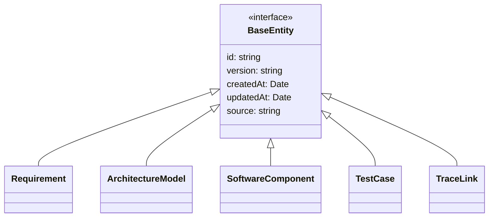
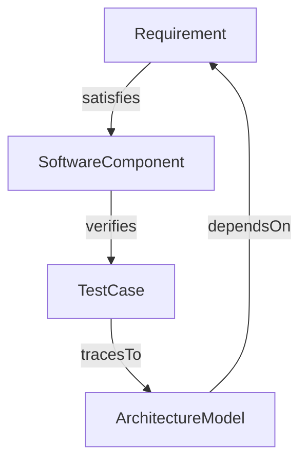

# Unified Engineering Data Model

## Overview

This document defines the unified data model for Nexus Engineering System. The model consists of TypeScript interfaces that represent core engineering artifacts including requirements, architecture models (SysML subset), software components, test cases, and traceability links.

## Entity Diagrams



## Core Types

### BaseEntity (Common Metadata)

All entities inherit from `BaseEntity` which provides common metadata fields:

- `id` (string): Unique identifier
- `version` (string): Semantic version of the entity
- `createdAt` (Date): Creation timestamp
- `updatedAt` (Date): Last modification timestamp
- `source` (string): Origin/traceability reference

### Requirement

```typescript
interface Requirement extends BaseEntity {
  type: 'functional' | 'non-functional' | 'system' | 'user';
  title: string;
  description: string;
  priority: 'low' | 'medium' | 'high' | 'critical';
  status: 'proposed' | 'approved' | 'rejected' | 'implemented' | 'verified';
  tags?: string[];
}
```

### ArchitectureModel

```typescript
interface ArchitectureModel extends BaseEntity {
  type: 'blockDefinition' | 'internalBlockDiagram' | 'stateMachine' | 'sequenceDiagram' |
        'parametricDiagnostic' | 'requirementTraceabilityMatrix';
  name: string;
  description: string;
  elements: ArchitectureElement[];
  relationships?: ArchitectureRelationship[];
}
```

### SoftwareComponent

```typescript
interface SoftwareComponent extends BaseEntity {
  name: string;
  type: 'module' | 'class' | 'interface' | 'enum' | 'service' | 'component' |
        'microService' | 'library' | 'configuration';
  description: string;
  path?: string;
  language?: string;
  technologies?: string[];
  dependencies?: string[];
  version?: string;
}
```

### TestCase

```typescript
interface TestCase extends BaseEntity {
  name: string;
  type: 'unit' | 'integration' | 'system' | 'acceptable' | 'performance' |
        'security' | 'usability';
  description: string;
  testSteps?: TestStep[];
  expectedResult: string;
  status: 'draft' | 'ready' | 'inProgress' | 'completed' | 'failed';
  automationStatus: 'manual' | 'automated' | 'partially-automated';
}
```

### TraceLink

```typescript
interface TraceLink extends BaseEntity {
  sourceId: string;
  sourceType: 'requirement' | 'architectureModel' | 'softwareComponent' |
               'testCase' | 'traceLink';
  targetId: string;
  targetType: 'requirement' | 'architectureModel' | 'softwareComponent' |
               'testCase' | 'traceLink';
  relationshipType: 'satisfies' | 'verifies' | 'tracesTo' | 'dependsOn' |
                     'refines' | 'conflictsWith';
  confidence: 'high' | 'medium' | 'low';
  description?: string;
}
```

**Field Descriptions:**
- `type`: Categorizes the requirement (functional/safety/performance/etc.)
- `title`: Brief descriptive title
- `description`: Detailed requirement description
- `priority`: Impact assessment
- `status`: Lifecycle state
- `tags`: Optional categorization tags

**Example:**
```typescript
{
  id: 'req-001',
  version: '1.0.0',
  createdAt: new Date('2026-07-02'),
  updatedAt: new Date('2026-07-02'),
  source: 'initial-design',
  type: 'functional',
  title: 'User Authentication',
  description: 'System shall provide secure user authentication via OIDC',
  priority: 'high',
  status: 'approved'
}
```

### Software Component Example

```typescript
{
  id: 'comp-001',
  version: '1.0.0',
  createdAt: new Date('2026-07-02'),
  updatedAt: new Date('2026-07-02'),
  source: 'github.com/example/repo@v1.0.0',
  name: 'AuthenticationManager',
  type: 'class',
  description: 'Manages user authentication and session handling',
  path: 'src/auth/AuthenticationManager.ts',
  language: 'TypeScript',
  technologies: ['Node.js', 'Express', 'JWT'],
  dependencies: ['crypto'],
  version: '2.1.0'
}
```

### Test Case Example

```typescript
{
  id: 'test-001',
  version: '1.0.0',
  createdAt: new Date('2026-07-02'),
  updatedAt: new Date('2026-07-02'),
  source: 'test-suite-001',
  name: 'Verify Login with Valid Credentials',
  type: 'unit',
  description: 'Test successful login with valid username/password',
  testSteps: [
    { stepNumber: 1, action: 'Navigate to login page' },
    { stepNumber: 2, action: 'Enter valid credentials' },
    { stepNumber: 3, action: 'Click login button' },
    { stepNumber: 4, action: 'Verify successful redirect to dashboard' }
  ],
  expectedResult: 'User should be logged in and redirected to dashboard',
  status: 'ready',
  automationStatus: 'automated'
}
```

### Trace Link Example

```typescript
{
  id: 'trace-001',
  version: '1.0.0',
  createdAt: new Date('2026-07-02'),
  updatedAt: new Date('2026-07-02'),
  source: 'manual-review',
  sourceId: 'req-001',
  sourceType: 'requirement',
  targetId: 'comp-001',
  targetType: 'softwareComponent',
  relationshipType: 'satisfies',
  confidence: 'high',
  description: 'This component fulfills all requirements specified in the authentication requirement'
}
```

## JSON Schema Validation

Each entity includes a JSON schema for validation:

- `RequirementSchema`: Validates requirement objects
- `ArchitectureModelSchema`: Validates architectural definitions
- `SoftwareComponentSchema`: Validates component metadata
- `TestCaseSchema`: Validates test cases and steps
- `TraceLinkSchema`: Validates traceability relationships

## Architecture Elements and Relationships

### Core ArchitectureElement Types

- `block`: Core building block
- `part`: Component part
- `port`: Interface/connection point
- `connector`: Connection between blocks
- `valueProperty`: Numeric/property value
- `unit`: Measurement unit
- `constraint`: Limitation or rule
- `interfaceDefinition`: System interface specification

### Relationship Types

- `composition`: Strong ownership relationship
- `aggregation`: Weaker ownership relationship
- `dependency`: Dependent relationship (uses)
- `association`: Simple connection
- `generalization`: Inheritance/isa relationship
- `realization`: Interface implementation

## Traceability Model

The traceability model supports:

- **Bidirectional Links**: Link between any two entity types
- **Multiple Relationships**: A requirement can be implemented by multiple components
- **Relationship Types**: Different semantic meanings (satisfies, verifies, tracesTo, etc.)
- **Confidence Scores**: Quality assessment of traceability
- **Cyclic Links**: Support for chained traceability



## Traceability Links Deep Dive

### Overview of Trace Links

Trace links form the backbone of the Nexus traceability system, enabling end-to-end visibility from requirements through implementation and testing. The TraceLink entity connects engineering artifacts across different domains using well-defined relationship types.

**Key Characteristics:**
- **Bidirectional**: Any artifact can be both a source and target of tracing
- **Multi-directional**: Supports complex relationships like cycles and chains
- **Confidence-rated**: Links have quality indicators for validation confidence
- **Type-safe**: Relationships are semantically defined

### Trace Link Relationship Types

| Relationship Type | Description | Typical Usage |
|------------------|-------------|---------------|
| `satisfies` | Shows that one artifact fulfills the needs of another | Requirement → SoftwareComponent |
| `verifies` | Indicates verification coverage | SoftwareComponent → TestCase |
| `tracesTo` | General traceability link with no specific semantics | Any → Any |
| `dependsOn` | Shows dependency relationships | ArchitectureModel → Requirement |
| `refines` | Shows a more detailed version of an artifact | Abstract requirement → Concrete implementation |
| `conflictsWith` | Indicates incompatible or contradictory artifacts | Requirement → Requirement |

### Trace Link Lifecycle

Trace links go through the following lifecycle:

1. **Creation**: Links are created manually or automatically during analysis
2. **Validation**: Confidence scores are assigned based on evidence quality  
3. **Review**: Engineering teams validate link accuracy
4. **Change Management**: Links are updated when artifacts change
5. **Archival**: Historical links are preserved for audit purposes

### API Endpoints

The traceability API provides CRUD operations and filtering capabilities:

- `GET /api/trace-links` - List all trace links with pagination support
- `GET /api/trace-links/:id` - Retrieve a specific trace link by ID  
- `POST /api/trace-links` - Create a new traceability link
- `PUT /api/trace-links/:id` - Update an existing trace link
- `DELETE /api/trace-links/:id` - Remove a traceability link
- `GET /api/trace-links/source/:sourceType/:sourceId` - Filter links by source artifact
- `GET /api/trace-links/target/:targetType/:targetId` - Filter links by target artifact

### Trace Link Validation Rules

Trace links must satisfy the following validation constraints:

1. **Sources and Targets Required**: Both source and target identifiers must be provided
2. **Valid Relationship Types**: Only recognized relationship types are allowed  
3. **Matching Artifact Types**: Source/type and target/type combinations must be valid
4. **Confidence Level**: A confidence value (high/medium/low) is mandatory
5. **No Self-Links**: An artifact cannot trace to itself (loop prevention)
6. **Idempotency**: Creating the same link twice should not create duplicates

### Querying Trace Paths

Complex traceability queries can be performed using combinations of:

```typescript
// Get all components that satisfy a requirement
traceLinks = await getTraceLinksBySource('requirement', 'req-001');

// Find tests that verify an implementation
traceLinks = await getTraceLinksByTarget('softwareComponent', 'comp-001');

// Build a traceability matrix for audit purposes
const matrix: TraceLink[] = await listTraceLinks();
```

### Trace Link Example Scenarios

#### Scenario 1: End-to-End Traceability Chain

This example shows a complete trace chain from requirement to test:

```typescript
{
  "id": "trace-req-component",
  "version": "1.0.0", 
  "createdAt": "2026-07-04T10:00:00Z",
  "updatedAt": "2026-07-04T10:00:00Z",
  "source": "design-review-meeting",
  "sourceId": "req-user-auth",
  "sourceType": "requirement",
  "targetId": "comp-auth-service",
  "targetType": "softwareComponent",
  "relationshipType": "satisfies",
  "confidence": "high",
  "description": "Authentication service implements all user authentication requirements"
}

{
  "id": "trace-comp-test",
  "version": "1.0.0",
  "createdAt": "2026-07-04T10:15:00Z", 
  "updatedAt": "2026-07-04T10:15:00Z",
  "source": "test-suites",
  "sourceId": "comp-auth-service",
  "sourceType": "softwareComponent",
  "targetId": "test-login-flow",
  "targetType": "testCase",
  "relationshipType": "verifies", 
  "confidence": "high",
  "description": "Login test suite covers authentication service functionality"
}
```

#### Scenario 2: Architectural Validation Links

This shows how architecture models can trace back to requirements:

```typescript
{
  "id": "trace-arch-req", 
  "version": "1.0.0",
  "createdAt": "2026-07-04T11:30:00Z",
  "updatedAt": "2026-07-04T11:30:00Z",
  "source": "arch-review",
  "sourceId": "sysml-auth-diagram", 
  "sourceType": "architectureModel", 
  "targetId": "req-sec-audit-logging",
  "targetType": "requirement",
  "relationshipType": "tracesTo", 
  "confidence": "medium",
  "description": "System architecture includes audit logging component as specified"
}
```

#### Scenario 3: Conflict Detection

Identifying conflicting requirements:

```typescript
{
  "id": "trace-conflict-001",
  "version": "1.0.0", 
  "createdAt": "2026-07-04T14:20:00Z",
  "updatedAt": "2026-07-04T14:20:00Z",
  "source": "requirements-review", 
  "sourceId": "req-performance-latency",
  "sourceType": "requirement",
  "targetId": "req-security-validation-timeout", 
  "targetType": "requirement", 
  "relationshipType": "conflictsWith",
  "confidence": "high",
  "description": "Performance requirement conflicts with security validation timeout requirements"
}
```

## Advanced Trace Link Examples

### Confidence-Based Filtering

API queries can filter by confidence level for focused analysis:

```typescript
// Get only high-confidence links for audit reporting
const highConfidenceLinks = await fetch('/api/trace-links?confidence=high');

// Verify implementation coverage with medium+ confidence  
const verifiedCoverage = await filterByConfidence(['high', 'medium']);
```

### Dynamic Trace Path Building

Build complete trace paths programmatically:

```typescript
async function buildTracePath(startId: string, startType: string): Promise<TraceLink[]> {
  const path: TraceLink[] = [];
  let currentSourceId = startId;
  let currentSourceType = startType;
  
  // Follow links until no more are found
  while (true) {
    const links = await getTraceLinksBySource(currentSourceType, currentSourceId);
    if (links.length === 0) break;
    
    // Continue with the first linked target as the new source
    path.push(...links);
    const nextLink = links[0];
    currentSourceId = nextLink.targetId;  
    currentSourceType = nextLink.targetType;
  }
  
  return path;
}
```

## Usage Examples

### Cross-Model Validation

```typescript
// Requirement that must be satisfied by components
const securityRequirement: Requirement = {
  id: 'req-sec-001',
  version: '1.0.0',
  createdAt: new Date(),
  updatedAt: new Date(),
  source: 'security-audit',
  type: 'non-functional',
  title: 'Data Encryption',
  description: 'All data must be encrypted at rest and in transit',
  priority: 'critical',
  status: 'approved',
  tags: ['security', 'encryption']
};

// Component that satisfies the requirement
const cryptoModule: SoftwareComponent = {
  id: 'comp-crypto-001',
  version: '1.0.0',
  createdAt: new Date(),
  updatedAt: new Date(),
  source: 'github.com/secureapp/crypto@v2.0.0',
  name: 'CryptoModule',
  type: 'module',
  description: 'Provides encryption/decryption utilities',
  path: 'modules/crypto/CryptoModule.js',
  technologies: ['Node.js', 'crypto', 'openssl'],
  dependencies: []
};

// Traceability link between requirement and component
const traceLink: TraceLink = {
  id: 'trace-sec-001',
  version: '1.0.0',
  createdAt: new Date(),
  updatedAt: new Date(),
  source: 'validation',
  sourceId: 'req-sec-001',
  sourceType: 'requirement',
  targetId: 'comp-crypto-001',
  targetType: 'softwareComponent',
  relationshipType: 'satisfies',
  confidence: 'high',
  description: 'Implements AES-256 encryption for data at rest'
};
```