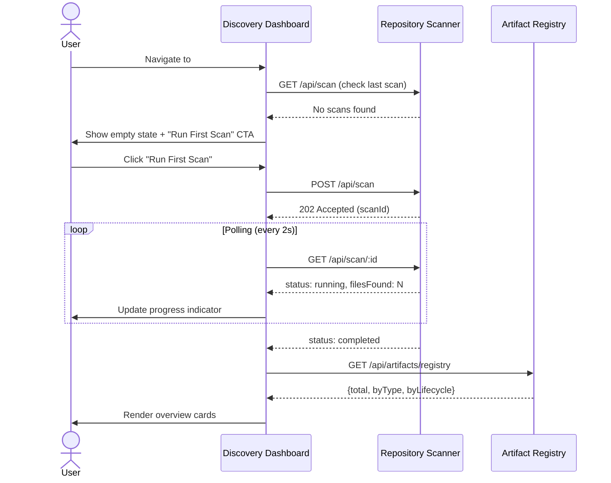
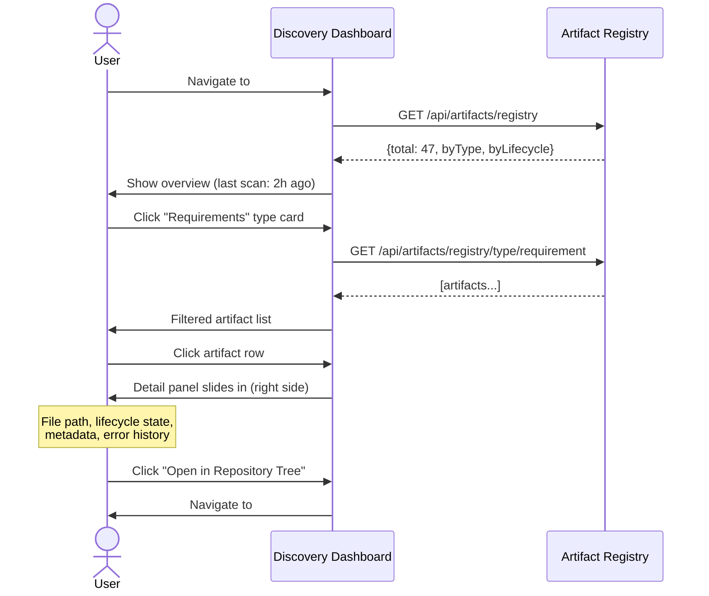

# Discovery Dashboard — User Flow

## Primary Navigation

```mermaid
graph TD
    A[App Shell] -->|hash: #discovery| B[Discovery Dashboard]
    
    B --> C[Scan Overview]
    B --> D[Artifact Browser]
    B --> E[System Health]
    
    C -->|Click artifact type card| D
    C -->|Click "Run Scan"| F[Scan Triggered]
    F -->|Auto-refresh /poll| C
    
    D -->|Click artifact row| G[Artifact Detail Panel]
    D -->|Filter by type| D
    D -->|Filter by lifecycle| D
    D -->|Click "Open in Repository Tree"| H[Repository Tree View]
    D -->|Click "Open in Graph Builder"| I[Graph Builder View]
    
    G -->|Click file path| H
    G -->|Click "View Traceability"| I
    G -->|Click "Reparse"| F
    
    E -->|Click artifact type| D
    E -->|Click error count| D (filtered to error)
```

## User Journey: First-Time Use



## User Journey: Daily Use



## Navigation Integration

| From | To | Trigger |
|------|----|---------|
| Discovery Dashboard | Repository Tree | Click file path / "Open in Repository Tree" |
| Discovery Dashboard | Graph Builder | Click "View Traceability" / "Open in Graph Builder" |
| Repository Tree | Discovery Dashboard | Click artifact badge on file |
| Graph Builder | Discovery Dashboard | Click artifact node → detail |
| Nav bar | Discovery Dashboard | Click "Discovery" tab (new nav item) |

## States & Transitions

| State | Condition | UI |
|-------|-----------|-----|
| Empty | No scans ever | Illustration + "Run First Scan" CTA |
| Idle | Last scan complete, no active scan | Overview cards, "Run Scan" button enabled |
| Scanning | POST /scan returned 202 | Progress bar, animated pulse, button disabled |
| Error | Scan or parse failed | Error banner, error count card highlighted |
| Loading | Initial mount / filter change | Skeleton cards (3-column grid) |

## Design Lens References

- **Progressive Disclosure**: Overview → Browser → Detail. Each level reveals more without overwhelming.
- **Fitts's Law**: "Run Scan" button is a large primary CTA in the top-right of overview — high target area.
- **Jakob's Law**: Tab-based navigation matches existing ArtifactViewer pattern.
- **Recognition over Recall**: Status badges use color + text labels, not color alone.
- **Information Scent**: Type cards in overview show counts — user knows before clicking how many items they'll find.
